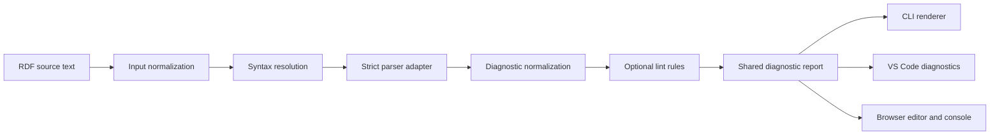

# RDF Syntax Diagnostics: Technical Specification Baseline

## 1. Overview

The proposed system should use **one shared diagnostic engine with three presentation adapters**:



This architecture prevents the command-line tool, browser application, and VS Code extension from disagreeing about whether the same RDF document is well-formed.

---

## 2. Scope: What Does “Invalid RDF” Mean?

“Valid RDF” is too ambiguous for the product and its documentation. A file can fail at several different layers.

| Layer | Question being answered | Example |
|---|---|---|
| Character encoding | Can the bytes be decoded as expected? | Invalid UTF-8 sequence |
| Format detection | Which concrete syntax should interpret the document? | A `.owl` file could contain RDF/XML or Turtle |
| Lexical analysis | Are individual tokens legal? | Invalid escape sequence in a string |
| Grammar parsing | Are the tokens arranged according to the syntax grammar? | Missing `.` at the end of a Turtle statement |
| RDF data-model conformance | Did parsing produce legal RDF terms and triples or quads? | Literal used as a predicate |
| Datatype lexical checking | Does a lexical form belong to its stated datatype? | `"not-a-date"^^xsd:date` |
| Linting | Is legal RDF suspicious, unclear, or nonportable? | Declared prefix is never used |
| Shape validation | Does the graph satisfy SHACL or ShEx constraints? | A person lacks a required identifier |
| Ontology consistency | Is the graph consistent under an entailment regime? | An individual belongs to disjoint OWL classes |

The first product should cover:

1. Character encoding
2. Format detection
3. Lexical analysis
4. Grammar parsing
5. RDF data-model conformance

Datatype lexical checking and linting should follow shortly afterward.

SHACL validation, ShEx validation, OWL reasoning, undefined ontology-term checking, and ontology-quality checks should remain separately named modules.

---

## 3. Critical Terminology

### 3.1 Core RDF and parsing terminology

| Term | Recommended meaning |
|---|---|
| **RDF document** | Source text or bytes containing an RDF serialization |
| **Concrete syntax** | A particular RDF serialization language, such as Turtle or RDF/XML |
| **Syntax profile** | The syntax plus its version and strictness settings |
| **Token** | A lexical unit such as an IRI, prefix name, literal, punctuation mark, or keyword |
| **Tokenization** | Dividing source text into classified tokens |
| **Lexer** | A component that recognizes tokens |
| **Lexical analyzer** | Another name for a lexer |
| **Parser** | A component that applies the grammar and constructs RDF terms, triples, or quads |
| **Parse error** | A failure to match the selected concrete syntax |
| **Diagnostic** | A structured description of an error, warning, information item, or hint |
| **Source location** | A line, column, and preferably character range associated with a diagnostic |
| **Detection location** | The location where the parser realized that parsing could not continue |
| **Probable cause location** | An earlier location that may have caused a later failure |
| **Error recovery** | Continuing analysis after an error so additional diagnostics can be reported |
| **Strict parsing** | Rejecting constructs outside the selected syntax and version |
| **Permissive parsing** | Accepting extensions, mixed syntax, or recoverable deviations |
| **Linting** | Reporting suspicious or discouraged constructs that may still be legal |
| **Rule** | A named, configurable diagnostic check with a stable identifier |
| **Quick fix** | A proposed source edit that may resolve a diagnostic |
| **Code action** | The VS Code or Language Server Protocol term for an action associated with a diagnostic |
| **Formatter** | A tool that changes layout without intentionally changing the represented graph |
| **Serializer** | A component that emits an RDF graph or dataset in a concrete syntax |
| **Writer** | Another name for a serializer |
| **Canonicalization** | Producing a formally defined canonical representation |
| **Validation** | Checking data against an explicitly identified constraint system |
| **Language server** | An editor-independent process that supplies diagnostics and language features through LSP |

### 3.2 Highlighting terminology

#### Syntax highlighting

Syntax highlighting classifies and colors source tokens.

It may distinguish:

- Prefix declarations
- Prefix names
- IRIs
- Blank nodes
- Literals
- Language tags
- Datatype IRIs
- Comments
- Keywords
- Punctuation

Syntax highlighting does **not** prove that the complete document parses successfully.

#### Semantic highlighting

Semantic highlighting uses parser or language-service knowledge to distinguish tokens according to their interpreted role.

For RDF, semantic highlighting could distinguish:

- Prefix declarations from prefix uses
- Subjects from predicates
- Datatype IRIs from ordinary object IRIs
- Graph names from ordinary subjects
- Undefined prefix names from defined prefix names
- Predicates from class or individual IRIs

#### Diagnostics

**Diagnostics** is the preferred term for:

- Editor squiggles
- Problems-panel entries
- Line-number-based error messages
- Warnings
- Informational messages
- Hints
- CLI error entries
- Browser-console entries

---

## 4. Supported RDF Formats

### 4.1 Recommended implementation order

1. Turtle
2. TriG
3. N-Triples
4. N-Quads
5. RDF/XML
6. JSON-LD
7. RDFa
8. Notation3
9. TriX
10. RDF/JSON
11. Compact SHACL syntax, if desired later

The first four formats belong to a closely related parser family and can share much of the implementation.

### 4.2 RDF version profiles

The application should expose explicit parsing profiles rather than one undifferentiated “RDF” mode.

```text
rdf11-strict
rdf12-draft-strict
compatible-permissive
```

Recommended default configuration:

```yaml
rdfVersion: "1.1"
strict: true
experimentalRdf12: false
```

Draft RDF 1.2 support should be visibly labeled as experimental or draft support.

---

## 5. Format Resolution

The application should not expose failures from every possible parser as though all interpretations were equally plausible.

Use this syntax-selection precedence:

1. Explicit user selection
2. CLI `--syntax` option
3. Trusted media type
4. Configured extension mapping
5. Standard filename extension
6. Content sniffing
7. Ranked candidate parsers, only when still unresolved

### 5.1 Successful format selection

```text
Selected syntax: Turtle
Selection source: filename extension
Confidence: high
```

### 5.2 Conflicting evidence

```text
Likely syntax: RDF/XML
Selection source: content sniffing
Confidence: medium

Conflicting evidence:
- Filename extension suggests Turtle
- XML declaration suggests XML
```

### 5.3 Suggested conflict diagnostic

```text
RDF1002: Document content does not resemble Turtle.

The filename indicates Turtle, but the document begins with an XML declaration.
Try interpreting the document as RDF/XML.
```

The application should not initially display a dozen raw parser stack traces.

---

## 6. Functional Capabilities

### 6.1 Input handling

The system shall support:

- UTF-8 text
- Optional byte-order marks
- CRLF line endings
- LF line endings
- CR line endings
- File input
- Pasted text
- Editor buffers
- Standard input
- Stream input
- Explicit base IRI
- Explicit syntax selection
- Extension-based syntax selection
- Media-type-based syntax selection
- Content sniffing
- Cancellation of an in-progress parse
- Configurable file-size limits
- Configurable memory and resource limits
- Compressed files as a later CLI feature

### 6.2 Diagnostic locations

Every diagnostic should contain, when available:

- Start line
- Start column
- End line
- End column
- Absolute character offset
- Optional byte offset
- Source URI or filename
- Source excerpt
- Caret or highlighted range
- Related locations
- Location-confidence classification

Location confidence should be one of:

```text
exact
approximate
unknown
```

The system should distinguish between detection and probable cause.

```text
Error detected at line 18, column 1.
Probable cause: unterminated statement beginning at line 14, column 1.
```

Internally, positions should be compatible with VS Code’s zero-based UTF-16 indexing. Human-facing CLI and browser reports should normally use one-based line and column numbers.

### 6.3 Diagnostic content

```typescript
interface SourcePosition {
  line: number;
  column: number;
  characterOffset?: number;
  byteOffset?: number;
}

interface SourceRange {
  start: SourcePosition;
  end: SourcePosition;
}

interface RelatedLocation {
  message: string;
  source?: string;
  range?: SourceRange;
}

interface RdfDiagnostic {
  code: string;

  severity:
    | "error"
    | "warning"
    | "information"
    | "hint";

  stage:
    | "encoding"
    | "format-detection"
    | "lexical"
    | "grammar"
    | "rdf-model"
    | "datatype-lexical"
    | "external-resource"
    | "lint"
    | "internal";

  message: string;

  syntax?: string;
  rdfVersion?: string;
  source?: string;

  range?: SourceRange;
  relatedLocations?: RelatedLocation[];

  found?: string;
  expected?: string[];

  explanation?: string;
  suggestedFix?: string;

  ruleId?: string;
  specificationReference?: string;

  parserName?: string;
  parserVersion?: string;

  locationConfidence:
    | "exact"
    | "approximate"
    | "unknown";

  recovered?: boolean;
  possiblyCascading?: boolean;
}
```

### 6.4 Stable diagnostic codes

Human-readable messages may improve over time. Stable diagnostic codes should remain dependable for tests, CI systems, suppressions, and documentation.

```text
RDF0001  Unknown or unsupported syntax
RDF0002  Conflicting format evidence
ENC1001  Invalid UTF-8 sequence

TTL1001  Expected statement terminator
TTL1002  Undefined prefix
TTL1003  Invalid prefixed name
TTL1004  Unterminated string
TTL1005  Invalid IRI escape

TRIG1001 Graph block not closed

NT1001   Invalid N-Triples statement
NQ1001   Invalid graph name

XML1001  XML is not well-formed
RDFX1001 Invalid RDF/XML node element
RDFX1002 Invalid RDF/XML property element

JSON1001 JSON is not well-formed
JLD1001  Invalid JSON-LD context
JLD1002  Remote context unavailable

MODEL1001 Predicate is not an IRI
DTYPE2001 Invalid lexical form for datatype

LINT2001 Declared prefix is unused
LINT2002 Prefix is used but not declared
LINT2003 Relative IRI has no effective base
```

### 6.5 Multiple-error reporting

The system should support two modes:

```text
fail-fast
recover-and-continue
```

Fail-fast mode is easier and more reliable for the first release.

Recovery mode should mark recovered and possibly cascading diagnostics:

```json
{
  "recovered": true,
  "possiblyCascading": true
}
```

The browser and VS Code interfaces should be able to collapse likely cascading errors beneath the first primary error.

### 6.6 Linting capabilities

Linting must remain distinct from syntax parsing.

Candidate lint rules include:

- Prefix declared but unused
- Prefix used without a declaration
- Duplicate prefix declaration
- Prefix rebound to a different namespace
- Relative IRI without an effective base
- Suspicious IRI containing whitespace
- Suspicious unescaped characters in an IRI
- Discouraged blank-node identifier pattern
- Noncanonical language-tag casing
- Duplicate triple
- Duplicate quad
- Very long literal
- Invalid datatype lexical form
- Mixed RDF 1.1 and draft RDF 1.2 constructs
- Nonportable parser extension
- Empty named graph, where detectable
- RDF/XML constructs that are legal but difficult to maintain

Each lint rule should have:

- Stable identifier
- Default severity
- Configuration options
- Per-file suppression
- Documentation
- Good examples
- Bad examples
- True-positive tests
- False-positive tests

### 6.7 Reporting formats

All deployment environments should consume the same diagnostic-report model.

Required output renderers:

```text
human
json
compact-json
sarif
```

SARIF support is especially useful for CI systems and static-analysis integrations.

### 6.8 Security and privacy

Default behavior should be:

- Parse locally
- Do not upload source
- Do not dereference arbitrary IRIs
- Do not retrieve JSON-LD contexts automatically
- Do not follow ontology imports automatically
- Do not execute scripts embedded in HTML or RDFa
- Apply limits to remote context depth
- Apply redirect limits
- Apply download-size limits
- Apply request timeouts
- Protect against XML entity expansion
- Permit cancellation
- Apply memory limits
- Clearly display when a result depends on a network resource

---

## 7. Gherkin User Stories and Scenarios

### Feature: Explicit syntax checking

```gherkin
Feature: Check an RDF document using an explicitly selected syntax

  Scenario: A well-formed Turtle document passes
    Given a document containing well-formed Turtle
    And the selected syntax is "Turtle"
    When the document is checked
    Then the result shall contain no error diagnostics
    And the result shall identify the syntax as "Turtle"
    And the result shall report the number of parsed triples

  Scenario: A Turtle document is checked strictly
    Given a document containing syntax that is accepted only in permissive mode
    And the selected profile is "rdf11-strict"
    When the document is checked
    Then the result shall contain an error diagnostic
    And the diagnostic shall identify the rejected construct
    And the diagnostic shall not silently reinterpret the document
```

### Feature: Syntax determination

```gherkin
Feature: Determine the intended RDF concrete syntax

  Scenario: Syntax is inferred from a recognized extension
    Given a file named "ontology.ttl"
    And no syntax was explicitly selected
    When the file is checked
    Then the selected syntax shall be "Turtle"
    And the selection source shall be "filename extension"

  Scenario: File extension and content conflict
    Given a file named "ontology.ttl"
    And the file begins with an XML declaration
    When the file is checked
    Then the result shall report conflicting format evidence
    And the primary diagnostic shall explain that the extension suggests Turtle
    And the diagnostic shall suggest RDF/XML as an alternative interpretation

  Scenario: Syntax cannot be determined confidently
    Given a document with an unknown file extension
    And the content matches more than one candidate syntax
    When the document is checked automatically
    Then the result shall not claim a definite syntax
    And the result shall list ranked candidate syntaxes
    And the user shall be prompted to select a syntax
```

### Feature: Source-location diagnostics

```gherkin
Feature: Locate syntax problems in source text

  Scenario: A statement terminator is missing
    Given a Turtle statement without a terminating period
    When the document is checked
    Then an error diagnostic shall be returned
    And the diagnostic shall contain a start line and column
    And the diagnostic shall include a source excerpt
    And the diagnostic shall distinguish the detection location from the probable cause location

  Scenario: A diagnostic spans an invalid token
    Given a Turtle document containing an invalid prefixed name
    When the document is checked
    Then the invalid prefixed name shall be represented as a source range
    And an editor adapter shall be able to underline the complete range
```

### Feature: Prefix diagnostics

```gherkin
Feature: Diagnose prefix usage

  Scenario: A prefix is used but not declared
    Given a Turtle document that uses the prefix "cco"
    And the document contains no declaration for "cco"
    When linting is enabled
    Then the result shall contain diagnostic "TTL1002"
    And the diagnostic shall identify each unresolved use
    And the diagnostic shall not invent a namespace IRI

  Scenario: A prefix is declared but unused
    Given a well-formed Turtle document with an unused prefix declaration
    When linting is enabled
    Then the result shall contain warning "LINT2001"
    And syntax parsing shall still be reported as successful
```

### Feature: Cascading errors

```gherkin
Feature: Manage cascading parser errors

  Scenario: One missing delimiter causes later parse failures
    Given a Turtle document with one missing delimiter
    And later statements are otherwise well-formed
    When recovery mode is enabled
    Then the first failure shall be marked as the primary diagnostic
    And later dependent failures shall be marked as possibly cascading
    And the interface shall permit cascading diagnostics to be collapsed
```

### Feature: RDF/XML layers

```gherkin
Feature: Distinguish XML errors from RDF/XML errors

  Scenario: XML is not well-formed
    Given an RDF/XML document with an unclosed XML element
    When the document is checked
    Then the diagnostic stage shall be "grammar"
    And the diagnostic code shall begin with "XML"
    And RDF/XML interpretation shall not proceed past the XML failure

  Scenario: XML is well-formed but RDF/XML is invalid
    Given a well-formed XML document
    And the document violates the RDF/XML grammar
    When the document is checked as RDF/XML
    Then the diagnostic code shall begin with "RDFX"
    And the message shall state that XML parsing succeeded
    And the message shall explain the RDF/XML construct that failed
```

### Feature: JSON-LD resources

```gherkin
Feature: Control JSON-LD context retrieval

  Scenario: Remote contexts are disabled
    Given a JSON-LD document referencing a remote context
    And network retrieval is disabled
    When the document is checked
    Then the result shall report that the context was not resolved
    And the diagnostic stage shall be "external-resource"
    And no HTTP request shall be made

  Scenario: A local context map resolves the context
    Given a JSON-LD document referencing a known context IRI
    And a local context mapping has been configured
    When the document is checked
    Then the local context shall be used
    And no HTTP request shall be made
```

### Feature: Command-line use

```gherkin
Feature: Use RDF diagnostics in scripts and CI

  Scenario: A file passes the configured threshold
    Given a well-formed RDF file
    When the CLI checks the file
    Then the process exit code shall be 0

  Scenario: A file contains a syntax error
    Given an RDF file with a syntax error
    When the CLI checks the file
    Then the process exit code shall be 1
    And a diagnostic shall be written to the configured output stream

  Scenario: Machine-readable output is requested
    Given an RDF file with a syntax error
    When the CLI is run with "--format json"
    Then the output shall be valid JSON
    And the output shall include the diagnostic code and source range
    And no decorative terminal characters shall be included
```

### Feature: Cross-environment consistency

```gherkin
Feature: Produce consistent diagnostics in every deployment

  Scenario: The same source is checked in all environments
    Given the same source text
    And the same syntax profile
    And the same rule configuration
    When the source is checked by the CLI, browser, and VS Code extension
    Then all environments shall return the same diagnostic codes
    And all environments shall return equivalent source ranges
    And differences shall be limited to presentation
```

### Feature: Browser interaction

```gherkin
Feature: Inspect browser diagnostics interactively

  Scenario: A user selects a browser diagnostic
    Given a checked RDF document with one or more diagnostics
    When the user selects a diagnostic from the results panel
    Then the editor shall move to the corresponding source location
    And the relevant source range shall be highlighted
    And the diagnostic explanation shall remain visible

  Scenario: Parsing is cancelled
    Given a large RDF document is being checked
    When the user cancels the operation
    Then the active parser operation shall stop
    And the interface shall remain responsive
    And the partial result shall not be presented as complete
```

### Feature: VS Code diagnostics

```gherkin
Feature: Display RDF diagnostics in VS Code

  Scenario: A syntax error appears in the Problems panel
    Given an open Turtle document with a syntax error
    When the extension checks the document
    Then the error shall appear in the Problems panel
    And the corresponding source range shall be underlined
    And the diagnostic shall include a stable diagnostic code

  Scenario: Obsolete checks are cancelled
    Given the extension is checking an open RDF document
    When the user changes the document again
    Then the obsolete check shall be cancelled
    And only diagnostics for the latest document version shall be displayed
```

---

## 8. Shared Package Architecture

A monorepo structure could be:

```text
packages/
  rdf-diagnostics-core/
  rdf-format-detection/
  rdf-parser-n3/
  rdf-parser-rdfxml/
  rdf-parser-jsonld/
  rdf-lint-rules/
  rdf-diagnostic-renderers/
  rdf-diagnostics-cli/
  rdf-diagnostics-vscode/
  rdf-diagnostics-web/
  test-fixtures/
  test-conformance/
```

### 8.1 `rdf-diagnostics-core`

Produces one primary artifact:

```text
DiagnosticReport
```

Responsibilities:

- Pipeline orchestration
- Configuration resolution
- Parser-adapter interfaces
- Diagnostic normalization
- Line and offset mapping
- Severity thresholds
- Cancellation
- Parser provenance
- Rule execution

### 8.2 Parser adapters

Each parser adapter produces:

```text
ParseResult
```

A parser adapter must translate parser-specific errors into the shared diagnostic model.

Raw stack traces should be retained only in debug mode.

### 8.3 `rdf-format-detection`

Produces:

```text
SyntaxDetectionResult
```

Its main responsibility is format identification, not graph parsing.

### 8.4 `rdf-lint-rules`

Produces:

```text
LintDiagnostic[]
```

Lint rules should run only after sufficient source structure or parsed RDF output is available.

### 8.5 Environment adapters

Each environment adapter consumes a `DiagnosticReport`.

Environment adapters should not independently interpret raw parser errors.

---

## 9. Suggested Shared Interfaces

```typescript
interface RdfDiagnosticOptions {
  syntax?: string;
  rdfVersion?: "1.1" | "1.2-draft";
  strict?: boolean;
  recoveryMode?: "fail-fast" | "recover-and-continue";
  baseIri?: string;
  lint?: boolean;
  networkAccess?: boolean;
  maximumDiagnostics?: number;
}

interface SyntaxDetectionResult {
  selectedSyntax?: string;
  confidence: "high" | "medium" | "low" | "unknown";
  selectionSource:
    | "explicit"
    | "media-type"
    | "configured-extension"
    | "filename-extension"
    | "content-sniffing"
    | "candidate-parsers"
    | "unknown";
  candidates: SyntaxCandidate[];
  conflicts: SyntaxEvidenceConflict[];
}

interface SyntaxCandidate {
  syntax: string;
  confidence: number;
  reasons: string[];
}

interface SyntaxEvidenceConflict {
  message: string;
  evidence: string[];
}

interface ParseResult {
  syntax: string;
  rdfVersion?: string;
  success: boolean;
  tripleCount?: number;
  quadCount?: number;
  diagnostics: RdfDiagnostic[];
}

interface DiagnosticSummary {
  errorCount: number;
  warningCount: number;
  informationCount: number;
  hintCount: number;
}

interface DiagnosticReport {
  source?: string;
  syntaxDetection?: SyntaxDetectionResult;
  parseResult?: ParseResult;
  lintDiagnostics?: RdfDiagnostic[];
  diagnostics: RdfDiagnostic[];
  summary: DiagnosticSummary;
  elapsedMilliseconds?: number;
}
```

---

## 10. Command-Line Roadmap

### Phase 1: Strict checker

Example commands:

```bash
rdf-doctor check ontology.ttl
rdf-doctor check ontology.ttl --syntax turtle
rdf-doctor check ontology.ttl --profile rdf11-strict
cat ontology.ttl | rdf-doctor check --syntax turtle
```

Capabilities:

- One file or standard input
- Turtle
- TriG
- N-Triples
- N-Quads
- Fail-fast parsing
- Line and column diagnostics
- Human-readable output
- JSON output
- Stable exit codes
- Explicit syntax override
- Extension-based detection
- No network access

### Phase 2: Batch and CI

```bash
rdf-doctor check "data/**/*.ttl"
rdf-doctor check . --recursive
rdf-doctor check . --format sarif --output rdf-results.sarif
rdf-doctor check . --fail-on warning
```

Add:

- Glob support
- Recursive directories
- Ignore files
- Configuration files
- SARIF output
- Summary counts
- Quiet mode
- Maximum diagnostic count
- File-size controls
- CI annotations
- RDF/XML support

### Phase 3: Linting and explanation

```bash
rdf-doctor lint ontology.ttl
rdf-doctor explain TTL1002
rdf-doctor rules
```

Add:

- Configurable lint rules
- Rule documentation
- Datatype lexical checks
- Related locations
- Suggested fixes
- JSON-LD support
- Controlled context loading
- Parser-comparison debug mode

### Proposed exit codes

```text
0  No diagnostics at or above failure threshold
1  Diagnostics reached the failure threshold
2  Invalid invocation, invalid configuration, or unreadable input
3  Internal tool failure
```

### Proposed CLI output

```text
ontology.ttl:14:27 error TTL1001 Expected "." after Turtle statement

12 | ex:Person1
13 |     rdf:type ex:Person ;
14 |     rdfs:label "Person One"
                               ^
15 |
16 | ex:Person2 rdf:type ex:Person .

Probable cause:
The statement beginning on line 12 does not have a terminating period.
```

---

## 11. Browser Roadmap

The browser application should remain entirely client-side and suitable for static hosting or installation as a PWA.

### Phase 1: Paste and inspect

Interface:

- Source-text editor
- Syntax dropdown
- Auto-detect option
- Check button
- Diagnostic table
- Human-readable console panel
- Click-to-jump diagnostics
- Error summary
- Warning summary
- Triple or quad count
- Elapsed-time display

Architecture:

- Shared core bundled for the browser
- N3.js parser adapter
- Web Worker for parsing
- No IndexedDB requirement initially
- No network retrieval
- CodeMirror 6 or Monaco editor

### Phase 2: File workbench

Add:

- Drag and drop
- Multiple files
- File tabs
- Extension-to-syntax associations
- JSON report download
- SARIF report download
- Copy-console-log action
- Recent files in IndexedDB
- Configurable rule profiles
- RDF/XML support
- Diagnostic searching
- Diagnostic filtering
- Keyboard navigation
- Accessible error markers

### Phase 3: Large-file mode

A normal editor may become the limiting component even when the RDF parser can stream efficiently.

Provide two operating modes:

```text
Editor mode
Diagnostic-only mode
```

Diagnostic-only mode should:

- Stream or chunk input where supported
- Avoid rendering the entire document
- Retain line offsets needed for excerpts
- Show only relevant source windows
- Permit cancellation
- Limit retained triples
- Avoid constructing an in-memory graph unless required

### Phase 4: Assisted repair

Add only conservative quick fixes:

- Insert a missing final period
- Close an obviously unterminated string
- Normalize language-tag casing
- Remove a duplicate prefix declaration
- Add a prefix declaration only when the namespace is configured or explicitly selected

Every fix should:

1. Preview a diff
2. Require user approval
3. Apply the change
4. Rerun the parser
5. Show the updated diagnostics

---

## 12. VS Code Roadmap

### Phase 1: Language registration and syntax highlighting

Provide:

- Turtle language identifier
- TriG language identifier
- N-Triples language identifier
- N-Quads language identifier
- File-extension associations
- TextMate grammar
- Comment handling
- Bracket matching
- Auto-closing strings
- Auto-closing IRIs
- Folding rules
- Indentation rules
- Prefix scopes
- IRI scopes
- Literal scopes
- Language-tag scopes
- Punctuation scopes

This phase improves readability but does not yet provide definitive syntax checking.

### Phase 2: Direct diagnostics extension

Use the VS Code extension API directly.

Add:

- Check on document open
- Debounced checking after edits
- Check on save
- Problems-panel entries
- Exact source-range underlining
- Diagnostic codes
- Diagnostic source names
- `Check RDF document` command
- Output-channel logging
- Workspace configuration
- Cancellation of obsolete checks
- Document-version checking

Beginning with the direct VS Code API is simpler than beginning with a full language server.

### Phase 3: Code actions and navigation

Add:

- Quick fixes
- Explain-diagnostic command
- Jump from prefix use to declaration
- Highlight all uses of a prefix
- Document symbols
- Hover information
- Configurable severity
- Workspace-wide checking
- Task integration
- CI-equivalent local checks

### Phase 4: Language Server Protocol

Move analysis behind a language server when one or more of these become true:

- Support is needed in editors other than VS Code
- Workspace analysis becomes expensive
- A long-lived parsed-document cache is needed
- Completion is added
- Symbol indexing is added
- Reference finding is added
- Project-wide analysis is added
- CLI and editor clients should communicate with the same persistent process

Recommended division of responsibility:

```text
TextMate grammar:
  Immediate lexical coloring

Shared strict parser:
  Definitive syntax diagnostics

Error-tolerant editor parser:
  Partial structure while the user is typing

Language server:
  Cross-document and cross-editor language intelligence
```

---

## 13. Implementation Roadmap

### Milestone 0: Diagnostic contract

Before building an interface:

- Finalize `DiagnosticReport`
- Finalize source-position conventions
- Finalize severity semantics
- Finalize diagnostic-code namespaces
- Create malformed RDF fixtures
- Write expected diagnostic snapshots

### Milestone 1: Turtle-family core and CLI

Implement:

- Turtle
- TriG
- N-Triples
- N-Quads
- Strict parser configuration
- Human renderer
- JSON renderer
- Extension detection
- Explicit syntax override

This establishes the reference behavior.

### Milestone 2: Browser interface

Implement:

- Shared diagnostic core
- Web Worker
- Text editor
- Diagnostic list
- File loading
- Report export

### Milestone 3: VS Code extension

Implement:

- TextMate grammar
- Direct diagnostics API
- Problems-panel integration
- Output channel
- Shared configuration

### Milestone 4: RDF/XML

Implement:

- XML well-formedness diagnostics
- RDF/XML grammar diagnostics
- Separate `XML` and `RDFX` diagnostic families

### Milestone 5: JSON-LD

Implement:

- JSON grammar diagnostics
- JSON-LD processing diagnostics
- Local context map
- Network disabled by default
- Explicitly controlled context retrieval

### Milestone 6: Linting and datatype checks

Implement:

- Prefix rules
- IRI rules
- Literal lexical-form rules
- Duplicate statements
- Portability profiles
- SARIF reporting

### Milestone 7: Rich language service

Implement:

- Error recovery
- Multiple diagnostics
- Quick fixes
- Prefix navigation
- Semantic highlighting
- LSP extraction

---

## 14. Testing Strategy

### 14.1 Fixture categories

Create fixtures for:

- Well-formed minimal documents
- Empty documents
- Empty comments-only documents
- Missing periods
- Missing semicolons
- Missing commas
- Undefined prefixes
- Duplicate prefix declarations
- Invalid prefixed names
- Invalid IRIs
- Unterminated short strings
- Unterminated long strings
- Invalid escape sequences
- Invalid language tags
- Invalid datatype lexical forms
- Invalid blank nodes
- Unclosed graph blocks
- Invalid graph names
- XML well-formedness failures
- RDF/XML grammar failures
- Invalid JSON
- JSON-LD context failures
- Extension and content conflicts
- Mixed line endings
- Byte-order marks
- Very long lines
- Very large literals
- Large files
- Parser cancellation
- Cascading errors

### 14.2 Test levels

Use:

- Unit tests for source-position mapping
- Unit tests for format detection
- Unit tests for diagnostic normalization
- Unit tests for lint rules
- Parser-adapter contract tests
- Cross-environment consistency tests
- CLI integration tests
- Browser component tests
- VS Code extension integration tests
- Conformance tests against published RDF syntax test suites
- Regression tests for every reported bug

### 14.3 Golden diagnostic snapshots

Each malformed fixture should have an expected result containing:

```json
{
  "code": "TTL1001",
  "severity": "error",
  "stage": "grammar",
  "range": {
    "start": {
      "line": 13,
      "column": 26
    },
    "end": {
      "line": 13,
      "column": 27
    }
  }
}
```

Messages may be snapshot-tested separately or less strictly so wording improvements do not break the stable API contract.

---

## 15. Configuration Model

Example project configuration:

```json
{
  "$schema": "./rdf-doctor.schema.json",
  "profile": "rdf11-strict",
  "syntaxDetection": {
    "enabled": true,
    "contentSniffing": true,
    "reportConflicts": true
  },
  "network": {
    "enabled": false,
    "allowRemoteJsonLdContexts": false,
    "allowOntologyImports": false
  },
  "diagnostics": {
    "maximum": 100,
    "failureThreshold": "error",
    "recoveryMode": "fail-fast"
  },
  "rules": {
    "LINT2001": "warning",
    "LINT2002": "error",
    "LINT2003": "warning"
  },
  "files": {
    "include": [
      "**/*.ttl",
      "**/*.trig",
      "**/*.nt",
      "**/*.nq",
      "**/*.rdf",
      "**/*.jsonld"
    ],
    "exclude": [
      "vendor/**",
      "dist/**",
      "node_modules/**"
    ]
  }
}
```

---

## 16. Nonfunctional Requirements

### Performance

The system should:

- Avoid loading a graph into memory when syntax checking alone is requested
- Support streaming parsers where available
- Run browser parsing in a Web Worker
- Cancel obsolete VS Code checks
- Permit configurable diagnostic limits
- Avoid repeatedly parsing unchanged content
- Cache parser results by document version where appropriate

### Consistency

The system shall:

- Use the same diagnostic core in all environments
- Use the same rule identifiers
- Use the same severity defaults
- Use equivalent source ranges
- Produce deterministic reports for the same source and configuration

### Extensibility

The system shall support:

- Additional parser adapters
- Additional lint-rule packages
- Additional report renderers
- Additional editor adapters
- Additional RDF versions
- Additional conformance profiles

### Accessibility

The browser interface should:

- Not rely only on color
- Associate diagnostics with textual labels
- Support keyboard navigation
- Expose error severity to assistive technology
- Preserve sufficient contrast
- Permit source-location navigation without a mouse

---

## 17. Proposed Minimum Viable Product

The first usable release should be able to make this claim:

> Given a Turtle, TriG, N-Triples, or N-Quads document, the CLI, browser, and VS Code extension apply the same strict syntax profile and return normalized diagnostics containing stable codes, severity, source ranges, excerpts, and parser provenance.

The first release should explicitly **not** claim:

- SHACL validation
- ShEx validation
- OWL consistency checking
- Correct vocabulary usage
- Ontology-quality assurance
- Guaranteed repair of malformed documents
- Reliable continuation after every syntax error
- Final RDF 1.2 conformance while relevant specifications remain drafts

---

## 18. Immediate Next Design Artifacts

The next artifacts should be:

1. A finalized `DiagnosticReport` JSON Schema
2. A parser-adapter interface specification
3. A syntax-detection policy
4. A diagnostic-code registry
5. A malformed-Turtle fixture catalog
6. A cross-environment acceptance-test suite
7. A CLI command specification
8. A browser UI wireframe
9. A VS Code extension manifest and command plan

These artifacts will constrain all three deployments consistently and reduce the risk that each interface develops incompatible behavior.
